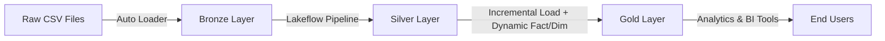

# Databricks Project: Medallion Architecture with Auto Loader and Lakeflow Pipelines

This project demonstrates how to implement the **Medallion Architecture** in Databricks using Auto Loader, incremental processing, and Lakeflow Declarative Pipelines to build a scalable and maintainable data platform.

---

## 🚀 Project Overview

1. **Auto Loader: Ingest Raw Data**
   - Automatically ingest raw CSV files into a **Managed Volume** with schema evolution and high-performance streaming/batch ingestion.

2. **Medallion Architecture**
   - **Bronze Layer**: Store raw ingested data.  
   - **Silver Layer**: Clean and transform the Bronze data, ensuring consistency and usability.  
   - **Gold Layer**: Build **incremental fact and dimension tables**, enabling analytics-ready datasets.  
   - Support **dynamic configurations** (catalog, schema, table names) for flexible use cases.

3. **Lakeflow Declarative Pipelines**
   - Orchestrate data movement across Bronze → Silver → Gold with **Lakeflow Declarative Pipelines**, ensuring maintainability, transparency, and automation.

---

## 🔄 Data Flow


1. Raw CSV files are uploaded and automatically ingested into the Bronze Layer.

2. Data is cleaned, deduplicated, and transformed in the Silver Layer.
  2-2. Lakeflow Pipelines manage and automate the entire flow, from ingestion to delivery.

3. Gold Layer produces analytics-ready datasets with incremental loading and dynamic fact/dimension generation.

## 📂 Project Structure (Catalog & Schema)
```bash
workspace/ # Root Workspace
│
├── bronze/ # Catalog: Bronze Layer
│ └── bronzevolume/ # Schema: Stores raw ingested data (Managed Volume)
│
├── silver/ # Catalog: Silver Layer
│ └── [tables]/ # Schema: Cleaned & transformed data
│
├── gold/ # Catalog: Gold Layer
│ ├── Tables/ # Schema: Fact and dimension tables
│ └── Volumes/ # Schema: Additional managed storage
│
├── raw/ # Catalog: Raw Data Storage
│ ├── rawvolume/ # Schema: Stores ingested raw files
│ ├── bronze/ # Schema: Bronze tables (raw staging)
│ ├── silver/ # Schema: Silver tables (curated)
│ └── gold/ # Schema: Gold tables (analytics-ready)
|
```

```markdown

---

### 🔄 Data Flow Across Catalogs

1. **Raw Catalog**  
   - `rawvolume` stores ingested raw CSV files.  
   - `raw.bronze`, `raw.silver`, and `raw.gold` schemas hold structured tables at each medallion stage.  

2. **Bronze Catalog**  
   - Contains `bronzevolume` schema for staging ingested data before further transformation.  

3. **Silver Catalog**  
   - Stores curated, cleaned, and transformed datasets.  

4. **Gold Catalog**  
   - Contains **fact and dimension tables** in the `Tables` schema, optimized for analytics.  
   - Can also leverage `Volumes` for managed storage.  

```

## ✅ Key Outcomes

- Automated ingestion of raw data into a Managed Volume.

- Full Bronze → Silver → Gold Medallion Architecture implementation.

- Incremental loads and dynamic dimension/fact table generation for scalable processing.

- End-to-end data flow orchestration using Lakeflow Declarative Pipelines.

## 📖 Learning Highlights

- Best practices for using Databricks Auto Loader.

- Designing and implementing the Medallion Architecture.

- Managing pipelines with Lakeflow Declarative Pipelines.

## 🚀 How to Use

1. This project is provided as a **ZIP file**, exported directly from the Databricks workspace.  
2. Simply open your own **Databricks workspace**, upload the ZIP file, and extract it to start using the project.  

